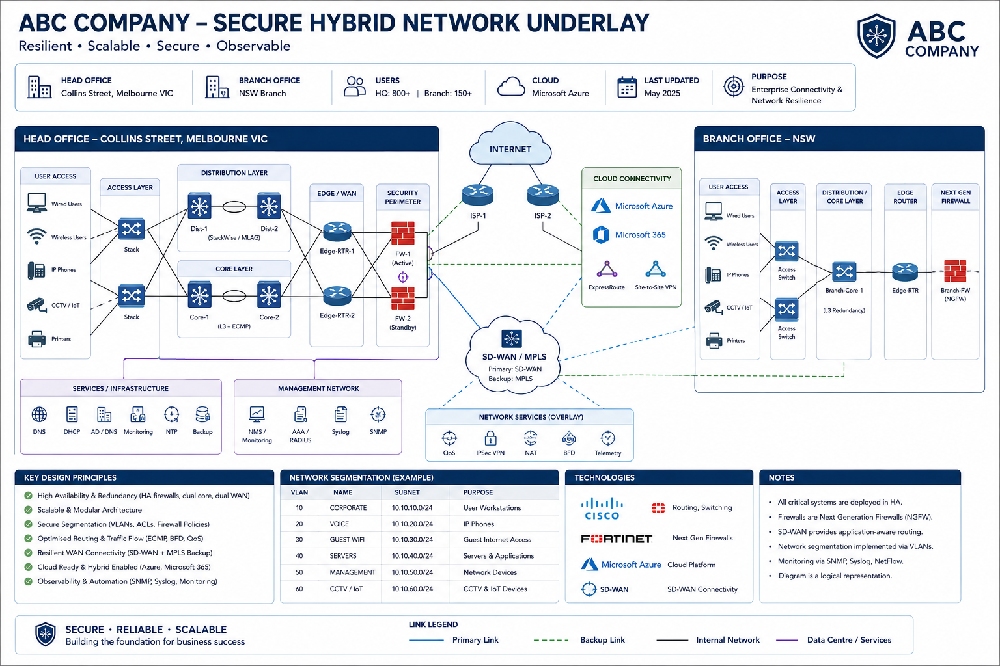

# Network Underlay


## Overview

The Network Underlay provides the foundational connectivity layer supporting enterprise infrastructure, cloud integration, security services, identity platforms, endpoint communications, and operational services.

This section contains enterprise reference architectures, design standards, implementation guidance, operational frameworks, and infrastructure best practices used to build scalable, resilient, secure, and highly available network environments.

The objective is to establish a standardised networking framework that supports business growth, operational reliability, cloud adoption, security integration, and future technology modernisation.

---

## Quick Navigation

| Domain                              | Description                                                                          |
| ----------------------------------- | ------------------------------------------------------------------------------------ |
| [BGP Routing](./bgp)                | Enterprise routing architectures, ISP redundancy, Azure ExpressRoute, route policies |
| [VLAN Design](./vlan-design)        | Enterprise segmentation, security zoning, switching standards                        |
| [Wireless](./wireless)              | Enterprise wireless architecture, Entra ID authentication, NAC integration           |
| [IP Addressing](./ip-addressing)    | Enterprise IP planning, subnet allocation, route summarisation                       |
| [Network Standards](./standards)    | Governance, ITIL, operational standards, change management                           |
| [Architecture Diagrams](./diagrams) | Enterprise architecture patterns and reference designs                               |

---

## Enterprise Reference Architecture



---

## Architecture Scope

The Network Underlay focuses on the core services required to support enterprise technology environments.

### Network Infrastructure

* Routing Architecture
* Switching Infrastructure
* VLAN Segmentation
* Enterprise Wireless
* WAN & SD-WAN Connectivity
* High Availability Design

### Core Infrastructure Services

* DNS
* DHCP
* NTP
* RADIUS
* SNMP
* Syslog
* NetFlow & Telemetry

### Identity Integration

* Microsoft Entra ID
* Conditional Access
* Network Access Control (NAC)
* Multi-Factor Authentication
* Device Compliance

### Operations & Governance

* Monitoring & Observability
* ITIL Service Management
* Change Management
* Configuration Standards
* Documentation Standards

---

## Technology Domains

### BGP & Enterprise Routing

Enterprise routing architectures supporting WAN connectivity, route optimisation, cloud integration, and ISP redundancy.

#### Technologies

* BGP
* OSPF
* Route Summarisation
* Policy-Based Routing
* Azure ExpressRoute
* SD-WAN

#### Deliverables

* BGP Design Templates
* Routing Standards
* Route Filtering Policies
* ISP Integration Models
* Routing Validation Procedures

---

### VLAN Architecture & Segmentation

Logical network segmentation supporting security, performance, and operational consistency.

#### Technologies

* VLANs
* Layer 2 Switching
* ACLs
* Security Zones
* Inter-VLAN Routing

#### Deliverables

* VLAN Standards
* Naming Conventions
* Segmentation Models
* Security Zoning Frameworks
* Enterprise Switching Standards

---

### Enterprise Wireless

Modern wireless architectures supporting secure mobility, identity-driven access control, and enterprise-scale deployments.

#### Technologies

* Wi-Fi 6
* Wi-Fi 6E
* Wi-Fi 7
* RADIUS
* 802.1X
* Microsoft Entra ID
* NAC
* WPA3 Enterprise

#### Deliverables

* Wireless Reference Architectures
* SSID Standards
* Authentication Frameworks
* RF Planning Standards
* Capacity Planning Guidance

---

### IP Address Management (IPAM)

Structured IP allocation and addressing frameworks supporting scalable enterprise deployments.

#### Technologies

* IPv4
* DHCP
* DNS
* Route Summarisation
* IP Planning

#### Deliverables

* Addressing Frameworks
* Subnet Standards
* Branch Office Models
* Cloud Addressing Models
* IP Governance Standards

---

### Core Infrastructure Services

Foundational services supporting enterprise operations and network functionality.

#### Services

* DNS
* DHCP
* NTP
* RADIUS
* SNMP
* Syslog
* NetFlow
* Telemetry

#### Deliverables

* Service Standards
* Availability Models
* Monitoring Standards
* Operational Procedures
* Validation Frameworks

---

### Network Topology & Architecture

Enterprise reference architectures and infrastructure design patterns.

#### Deliverables

* Campus Network Designs
* Branch Office Architectures
* WAN Topologies
* Hybrid Cloud Architectures
* Azure Connectivity Models
* SD-WAN Reference Designs

---

### Standards & Governance

Enterprise standards supporting operational consistency, security, compliance, and lifecycle management.

#### Areas Covered

* Infrastructure Standards
* Security Baselines
* Cloud Governance
* Change Management
* ITIL Service Management
* Monitoring & Observability
* Business Continuity
* Automation Standards

---

## Design Principles

### Scalability

Support future growth without requiring major architectural redesign.

### Resilience

Minimise service disruption through redundancy, failover, and high availability.

### Security

Apply Zero Trust, segmentation, authentication, and least privilege principles.

### Standardisation

Maintain consistent deployment standards and operational practices.

### Observability

Provide complete visibility through monitoring, logging, analytics, and reporting.

### Automation

Reduce operational complexity through Infrastructure as Code and automation practices.

### Cloud Integration

Enable seamless integration with cloud services and hybrid environments.

---

## Current Roadmap

* [ ] Enterprise Network Reference Architecture
* [ ] BGP & OSPF Design Framework
* [ ] VLAN Segmentation Standards
* [ ] Wireless Design Guide
* [ ] DNS & DHCP Standards
* [ ] Core Services Framework
* [ ] SD-WAN Architecture
* [ ] Network Operations Runbooks
* [ ] Validation & Testing Procedures
* [ ] Monitoring & Observability Framework

---

## Repository Structure

```text
01-network-underlay
│
├── bgp
├── vlan-design
├── wireless
├── ip-addressing
├── standards
├── diagrams
│
└── README.md
```

---

## Status

🚧 Active Development

This section is continuously expanded with enterprise architecture patterns, operational frameworks, governance standards, implementation guidance, cloud connectivity models, and modern networking reference designs.
