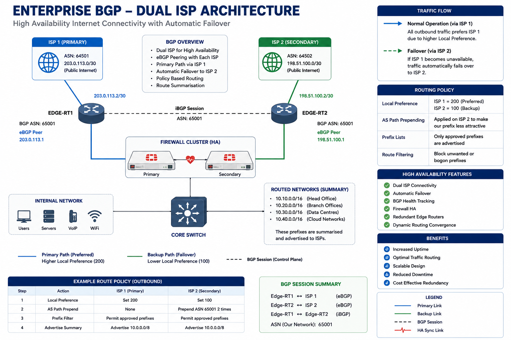

# Enterprise Network Architecture Diagrams

## Overview

This repository contains enterprise reference architectures, logical designs, physical topologies, cloud connectivity models, and infrastructure framework diagrams used throughout the Network Underlay domain.

The diagrams demonstrate common enterprise networking patterns, design principles, scalability considerations, security controls, operational models, and hybrid cloud connectivity frameworks.

These reference designs provide visual guidance for planning, deploying, managing, and supporting modern enterprise infrastructure environments.

---

## Architecture Library

### Enterprise Infrastructure

* Enterprise Network Reference Architecture
* Branch Office Reference Architecture
* Campus Network Architecture
* Multi-Site Enterprise Design
* Core Network Architecture

### Routing & WAN

* BGP Dual ISP Architecture
* OSPF Enterprise Routing Design
* SD-WAN Reference Architecture
* WAN Connectivity Models
* Internet Edge Design

### Network Segmentation

* VLAN Reference Architecture
* Security Zone Architecture
* Management Network Design
* DMZ Architecture
* Guest Network Segmentation

### Core Infrastructure Services

* DNS Architecture
* DHCP Architecture
* NTP Hierarchy Design
* RADIUS Authentication Architecture
* Network Services Framework

### Cloud Connectivity

* Azure ExpressRoute Architecture
* Hybrid Cloud Architecture
* Cloud Landing Zone Connectivity
* Site-to-Site VPN Design
* Identity Integration Architecture

### Wireless Architecture

* Enterprise Wireless Architecture
* Wireless Authentication Architecture
* High Density Wireless Design
* Guest Wireless Design
* Wi-Fi 6 / Wi-Fi 7 Reference Models

### Operations & Monitoring

* Monitoring Architecture
* Logging & Observability Design
* NetFlow & Telemetry Architecture
* Service Management Architecture
* Network Operations Centre (NOC) Design

---

## Current Diagram Repository

### Enterprise Network Reference Architecture

High-level enterprise architecture demonstrating relationships between networking, cloud, security, identity, endpoint management, and operational services.

---

### BGP Dual ISP Architecture

Enterprise WAN design supporting:

* ISP Redundancy
* Route Optimisation
* High Availability
* Business Continuity
* Cloud Connectivity

---

### Azure ExpressRoute Architecture

Hybrid cloud architecture demonstrating:

* Microsoft Azure Integration
* ExpressRoute Connectivity
* BGP Route Exchange
* Hybrid Networking

---

### VLAN Reference Architecture

Enterprise segmentation model supporting:

* Corporate Users
* Voice Services
* Guest Access
* Server Infrastructure
* Management Networks
* IoT & CCTV Systems

---

### IP Addressing Framework

Enterprise IP allocation framework demonstrating:

* Site Allocation
* Subnet Planning
* Cloud Integration
* Route Summarisation
* Growth Strategy

---

### Enterprise Wireless Architecture

Wireless infrastructure architecture supporting:

* Enterprise Mobility
* Secure Connectivity
* High-Density Deployments
* Centralised Management

---

### Entra ID Wireless Authentication

Identity-driven wireless authentication architecture integrating:

* Microsoft Entra ID
* RADIUS
* Conditional Access
* Multi-Factor Authentication
* Device Compliance
* NAC Integration

---

## Design Principles

All reference architectures are based on the following enterprise design principles:

### Scalability

Support future business growth without major redesign.

### Security

Apply Zero Trust, segmentation, and least-privilege principles.

### Resilience

Eliminate single points of failure and support business continuity.

### Standardisation

Maintain consistent deployment models and operational standards.

### Observability

Provide visibility through monitoring, telemetry, logging, and analytics.

### Automation

Support Infrastructure as Code and operational automation practices.

### Cloud Integration

Enable seamless integration with cloud services and hybrid environments.

---

## Diagram Standards

### Documentation Platforms

* Microsoft Visio
* Draw.io
* Lucidchart
* Excalidraw

### Diagram Categories

* High Level Design (HLD)
* Low Level Design (LLD)
* Reference Architecture
* Logical Architecture
* Physical Architecture
* Security Architecture
* Operational Architecture

### Diagram Requirements

All diagrams should include:

* Scope Definition
* Connectivity Flows
* Security Controls
* Dependencies
* Design Assumptions
* Revision History
* Version Control

---

## Future Diagrams

* SD-WAN Architecture
* SASE Architecture
* Zero Trust Architecture
* DNS Services Architecture
* DHCP Services Architecture
* NAC Architecture
* Identity Architecture
* Monitoring & Observability Framework
* Disaster Recovery Architecture
* Hybrid Cloud Landing Zone

---

## Status

🚧 Active Development

This architecture library continues to expand with enterprise networking, cloud connectivity, core infrastructure services, identity integration, operational governance, and hybrid architecture reference designs.
