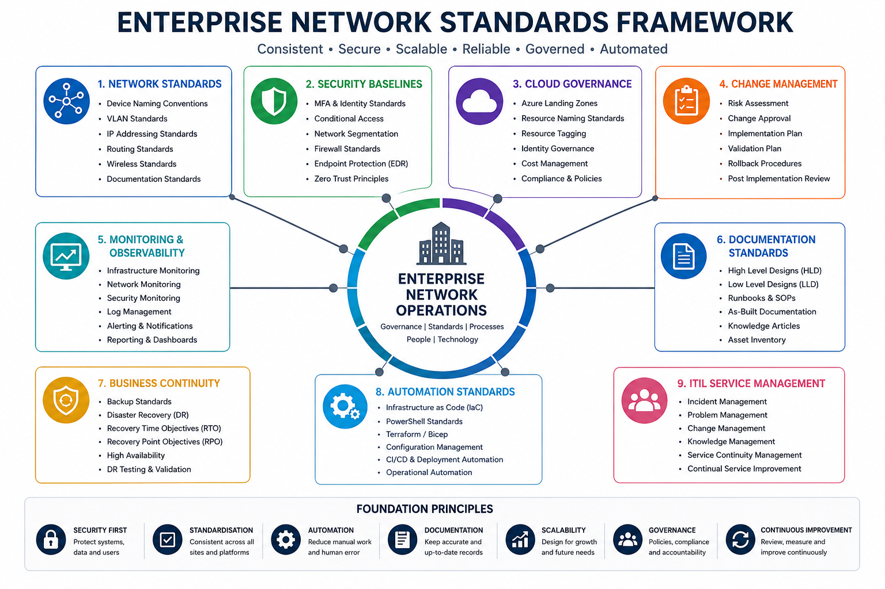

# Enterprise Infrastructure Standards & Governance


## Overview

Enterprise standards provide the foundation for secure, scalable, reliable, and operationally consistent technology environments.

This section contains infrastructure standards, governance frameworks, operational procedures, deployment guidelines, service management practices, and best practices used to support enterprise networking, cloud services, security, endpoint management, and operational excellence.

The objective is to ensure consistency across all technology platforms while reducing risk, improving security, supporting compliance, and enabling long-term scalability.

---

## Reference Standards Framework



---

## Objectives

* Standardisation
* Security
* Governance
* Scalability
* Operational Excellence
* Automation
* Compliance
* Business Continuity
* Service Reliability
* Continuous Improvement

---

## Standards Domains

| Domain                     | Focus Area                           |
| -------------------------- | ------------------------------------ |
| Network Standards          | Routing, Switching, Wireless         |
| Security Baselines         | Identity, Access Control, Protection |
| Cloud Governance           | Azure, Identity, Compliance          |
| Change Management          | Risk & Change Control                |
| Monitoring & Observability | Visibility & Reporting               |
| Documentation Standards    | Technical Documentation              |
| Business Continuity        | Recovery & Resilience                |
| Automation Standards       | Infrastructure as Code               |
| ITIL Service Management    | Service Operations & Governance      |

---

# Network Standards

Enterprise networking standards provide consistency across all sites and environments.

## Device Naming Convention

```text
MEL-FW-01
MEL-SW-01
MEL-AP-01
MEL-SRV-01

SYD-FW-01
SYD-SW-01
SYD-AP-01
SYD-SRV-01

BNE-FW-01
BNE-SW-01
BNE-AP-01
BNE-SRV-01
```

## VLAN Standards

| VLAN | Purpose                 |
| ---- | ----------------------- |
| 10   | Corporate               |
| 20   | Voice                   |
| 30   | Guest                   |
| 40   | Servers                 |
| 50   | Management              |
| 60   | CCTV / IoT              |
| 70   | Wireless Infrastructure |
| 80   | Printers                |
| 90   | DMZ                     |
| 99   | Native / Infrastructure |

## IP Addressing Standards

| Site      | Network       |
| --------- | ------------- |
| Melbourne | 10.10.0.0/16  |
| Sydney    | 10.20.0.0/16  |
| Brisbane  | 10.30.0.0/16  |
| Perth     | 10.40.0.0/16  |
| Azure     | 10.100.0.0/16 |

---

# Security Baselines

Security controls should be implemented consistently across all environments.

## Identity Standards

* Microsoft Entra ID
* Multi-Factor Authentication (MFA)
* Single Sign-On (SSO)
* Conditional Access
* Passwordless Authentication
* Privileged Identity Management (PIM)

## Network Security

* VLAN Segmentation
* ACL Enforcement
* IPS / IDS
* Secure VPN Access
* Zero Trust Architecture
* Network Access Control (NAC)

## Endpoint Security

* Microsoft Defender
* Endpoint Detection & Response (EDR)
* Device Compliance Policies
* Application Control
* Security Baselines

## Wireless Security

* WPA3 Enterprise
* 802.1X Authentication
* RADIUS Integration
* NAC Integration
* Guest Isolation

---

# Cloud Governance

Cloud environments should follow structured governance controls.

## Azure Standards

* Subscription Governance
* Resource Naming Standards
* Resource Tagging Policies
* Cost Management Controls
* Identity Governance
* Landing Zone Standards

## Cloud Security Controls

* Conditional Access
* Microsoft Defender for Cloud
* Security Monitoring
* Compliance Policies
* Identity Protection
* Privileged Access Controls

## Landing Zone Principles

* Secure by Default
* Policy Driven
* Scalable Architecture
* Governance First
* Automated Compliance

---

# Change Management

All production changes should follow a structured and auditable process.

## Required Documentation

* Change Request
* Risk Assessment
* Validation Plan
* Rollback Plan
* Business Approval
* Post Implementation Review

## Change Categories

### Standard Change

Pre-approved low-risk activities.

### Normal Change

Reviewed and approved through governance processes.

### Emergency Change

Urgent changes required to restore services or mitigate risk.

---

# Monitoring & Observability

Technology environments require proactive monitoring and visibility.

## Infrastructure Monitoring

* CPU Utilisation
* Memory Usage
* Storage Capacity
* Service Availability

## Network Monitoring

* SNMP
* Syslog
* NetFlow
* Telemetry
* Wireless Analytics

## Security Monitoring

* Authentication Events
* Firewall Logs
* VPN Activity
* IPS Alerts
* EDR Alerts
* Threat Detection

## Operational Monitoring

* Capacity Trends
* User Experience Metrics
* Service Availability
* SLA Reporting

---

# Documentation Standards

Every deployment should contain complete and accurate documentation.

## Design Documentation

* High Level Design (HLD)
* Low Level Design (LLD)

## Implementation Documentation

* Implementation Plan
* Test Plan
* Validation Plan
* Rollback Plan

## Operational Documentation

* Runbooks
* Knowledge Base Articles
* Standard Operating Procedures
* As-Built Documentation

---

# Business Continuity Standards

Business continuity planning ensures service resilience during disruptions.

## Backup Standards

* Daily Backups
* Offsite Replication
* Retention Policies
* Recovery Validation

## Disaster Recovery

* Recovery Time Objective (RTO)
* Recovery Point Objective (RPO)
* Recovery Testing
* DR Runbooks

## High Availability

* Redundant Infrastructure
* Failover Testing
* Load Distribution
* Service Resilience

---

# Automation Standards

Automation reduces risk and improves operational consistency.

## Infrastructure as Code

* Terraform
* Bicep
* ARM Templates

## Scripting Standards

* PowerShell
* Python
* Bash

## Automation Objectives

* Repeatability
* Standardisation
* Reduced Human Error
* Faster Deployments
* Improved Compliance

---

# ITIL Service Management

Enterprise infrastructure operations should align with ITIL principles to improve service quality and operational maturity.

## Incident Management

Restore normal service operation as quickly as possible.

### Objectives

* Minimise business impact
* Restore service availability
* Maintain SLA targets

---

## Problem Management

Identify and eliminate root causes of recurring incidents.

### Objectives

* Root Cause Analysis
* Known Error Management
* Preventative Improvements

---

## Change Enablement

Manage risk associated with production changes.

### Objectives

* Controlled Deployments
* Reduced Service Disruption
* Governance Compliance

---

## Release Management

Coordinate deployment activities across environments.

### Objectives

* Consistent Delivery
* Risk Reduction
* Deployment Validation

---

## Configuration Management

Maintain accurate records of technology assets and dependencies.

### Configuration Items

* Network Devices
* Firewalls
* Servers
* Virtual Machines
* Cloud Resources
* Wireless Infrastructure
* Software Assets

### Objectives

* Asset Visibility
* Dependency Mapping
* Impact Analysis
* Lifecycle Management

---

## Knowledge Management

Maintain operational knowledge and technical documentation.

### Required Artefacts

* HLD
* LLD
* Runbooks
* SOPs
* DR Guides
* Troubleshooting Guides
* As-Built Documentation

### Objectives

* Faster Resolution Times
* Reduced Operational Risk
* Improved Knowledge Sharing

---

## Service Level Management

Measure service performance against agreed targets.

### Availability Targets

| Service           | Target |
| ----------------- | ------ |
| Core Network      | 99.95% |
| Identity Services | 99.95% |
| Wireless Services | 99.90% |
| Internet Services | 99.90% |

### Response Targets

| Priority | Response Time     |
| -------- | ----------------- |
| Critical | 15 Minutes        |
| High     | 1 Hour            |
| Medium   | 4 Hours           |
| Low      | Next Business Day |

---

## Continual Service Improvement (CSI)

Continuous review and improvement of services, processes, and operational performance.

### Focus Areas

* Service Reviews
* KPI Monitoring
* Process Optimisation
* Technology Modernisation
* Operational Efficiency

---

# Operational Principles

## Security First

Apply Zero Trust and least privilege principles.

## Standardisation

Maintain consistent deployment models.

## Documentation

Keep documentation accurate and current.

## Automation

Automate repeatable tasks wherever possible.

## Scalability

Design solutions that support future growth.

## Continuous Improvement

Review and refine standards regularly.

---

# Validation Checklist

* [ ] Naming standards applied
* [ ] Security baselines enforced
* [ ] Monitoring enabled
* [ ] Documentation completed
* [ ] Change records maintained
* [ ] Backup validation completed
* [ ] Governance controls reviewed
* [ ] SLA reporting implemented

---

# Future Enhancements

* AIOps (Artificial Intelligence for IT Operations)
* SASE Governance Standards
* Zero Trust Framework Expansion
* FinOps Governance
* Infrastructure Compliance Automation
* Cloud Security Posture Management (CSPM)
* Automated Service Health Reporting

---

## Status

🚧 Active Development

This section is being expanded with enterprise governance frameworks, operational standards, cloud governance controls, ITIL-aligned service management practices, security baselines, automation standards, and infrastructure lifecycle management guidance.
