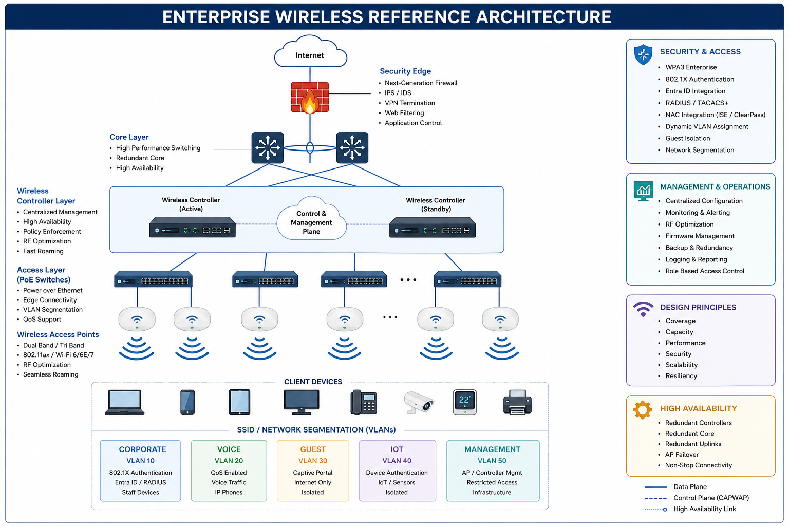
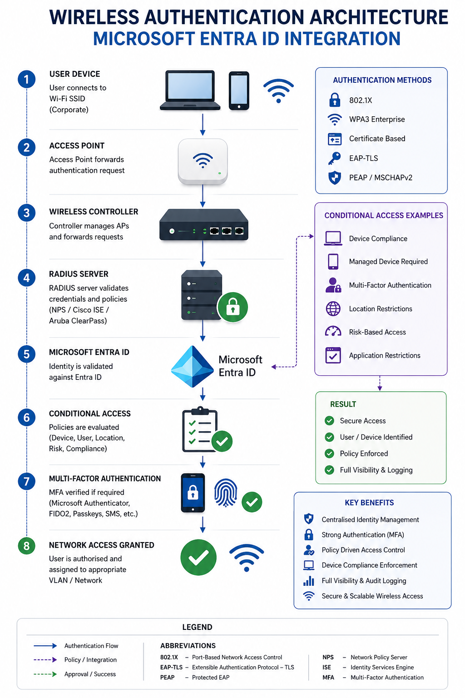

# Enterprise Wireless Architecture


## Overview

Enterprise wireless networks provide secure, scalable, and resilient connectivity for users, devices, applications, and business services.

Modern wireless architectures extend beyond basic connectivity and integrate with identity providers, endpoint compliance platforms, security controls, Zero Trust frameworks, and cloud-native management platforms.

This section contains enterprise wireless design principles, deployment standards, RF planning guidance, authentication architectures, security frameworks, and operational best practices.

---

## Reference Architecture



---

## Business Objectives

* Reliable wireless connectivity
* Secure user authentication
* Guest network isolation
* Seamless user mobility
* High-density user support
* Centralised identity management
* Device compliance validation
* Operational simplicity
* Future scalability

---

## Enterprise Authentication Architecture



### Authentication Flow

```text
User Device
     │
     ▼
Access Point
     │
     ▼
Wireless Controller
     │
     ▼
RADIUS Server
(NPS / Cisco ISE / Aruba ClearPass)
     │
     ▼
Microsoft Entra ID
     │
     ▼
Conditional Access
     │
     ▼
Multi-Factor Authentication
     │
     ▼
Network Access Granted
```

---

## Enterprise SSID Design

| SSID       | Authentication     | Purpose                    |
| ---------- | ------------------ | -------------------------- |
| Corporate  | 802.1X + Entra ID  | Staff Devices              |
| Voice      | Certificate Based  | Wireless Telephony         |
| Guest      | Captive Portal     | Internet Access Only       |
| IoT        | MAC Authentication | Sensors & Building Systems |
| Management | Restricted Access  | Wireless Infrastructure    |

---

## Wireless Network Components

| Component           | Purpose                 |
| ------------------- | ----------------------- |
| Access Points       | Wireless Connectivity   |
| Wireless Controller | Centralised Management  |
| Core Switches       | Network Aggregation     |
| Firewall            | Security Enforcement    |
| RADIUS Server       | Authentication Services |
| NAC Platform        | Access Control          |
| Microsoft Entra ID  | Identity Provider       |
| Intune              | Device Compliance       |
| Monitoring Platform | Visibility & Reporting  |

---

## Identity & Authentication

### Microsoft Entra ID

Enterprise identity platform providing:

* Single Sign-On (SSO)
* Multi-Factor Authentication (MFA)
* Conditional Access
* Identity Governance
* Risk-Based Access Control
* User Lifecycle Management

### RADIUS Authentication

Centralised authentication and authorisation services supporting:

* 802.1X Authentication
* Dynamic VLAN Assignment
* User Validation
* Device Authentication
* Policy Enforcement
* Audit Logging

### Conditional Access

Conditional Access policies can enforce:

* Device compliance
* Managed device requirements
* Location restrictions
* Risk-based access decisions
* MFA requirements
* Session controls

### Passwordless Authentication

Modern authentication methods include:

* Microsoft Authenticator
* Passkeys
* FIDO2 Security Keys
* Windows Hello for Business
* Certificate-Based Authentication

---

## Network Access Control (NAC)

Network Access Control solutions provide identity-aware network access management.

### Supported Platforms

* Cisco ISE
* Aruba ClearPass
* FortiNAC

### Capabilities

* Device onboarding
* Dynamic VLAN assignment
* Guest access workflows
* Device profiling
* Endpoint posture assessment
* Policy-based access control

---

## Device Compliance & Endpoint Integration

Wireless access can integrate with Microsoft Intune and endpoint management platforms.

### Compliance Validation

* BitLocker Encryption
* Endpoint Protection Status
* Operating System Compliance
* Security Baseline Compliance
* Device Ownership Validation

### Integration Platforms

* Microsoft Intune
* Microsoft Defender
* Entra ID
* Conditional Access

---

## Security Architecture

### WPA3 Enterprise

Recommended encryption standard for enterprise deployments.

### Network Segmentation

Wireless traffic should be segmented into dedicated security zones.

### Guest Isolation

Guest users should never have direct access to internal resources.

### Dynamic VLAN Assignment

Assign users to network segments based on identity and policy.

### Authentication Logging

Capture and monitor authentication events for security visibility.

---

## Zero Trust Wireless Access

Modern wireless environments should adopt Zero Trust principles.

### Verify Explicitly

Authenticate every user and device.

### Use Least Privilege Access

Grant only the access required.

### Assume Breach

Continuously validate trust and monitor activity.

### Continuous Verification

Re-evaluate access based on risk, device posture, and user behaviour.

---

## Secure Access Service Edge (SASE)

Enterprise wireless environments increasingly integrate with SASE platforms.

### Common Components

* SD-WAN
* ZTNA
* CASB
* Secure Web Gateway
* Cloud Firewall Services

### Benefits

* Simplified security architecture
* Centralised policy management
* Improved remote access security
* Enhanced user experience

---

## Wireless Site Surveys

### Predictive Surveys

Used during planning and design phases.

### Active Surveys

Validate real-world coverage and performance.

### Passive Surveys

Assess RF conditions without generating traffic.

### Post-Deployment Validation

Confirm design objectives have been achieved.

---

## RF Planning & Optimisation

### Coverage

Provide consistent signal coverage throughout operational areas.

### Capacity

Support expected client density and future growth.

### Roaming

Enable seamless movement between access points.

### Channel Planning

Reduce interference and optimise spectrum utilisation.

### Power Optimisation

Balance coverage and minimise RF overlap.

---

## Observability & Analytics

Modern wireless environments require operational visibility.

### Monitoring Capabilities

* Client Experience Monitoring
* Application Visibility
* RF Analytics
* Capacity Forecasting
* AI-Assisted Optimisation
* Performance Trending

---

## Vendors

### Cisco Catalyst Wireless

Enterprise wireless platform for large-scale deployments.

### Cisco Meraki

Cloud-managed wireless platform supporting distributed environments.

### Aruba

Enterprise-grade wireless networking and mobility solutions.

### Juniper Mist

AI-driven wireless platform providing enhanced visibility and automation.

### Ubiquiti

Scalable wireless solutions for SMB and branch deployments.

### FortiAP

Integrated wireless platform supporting Fortinet Security Fabric architectures.

---

## Modern Wireless Standards

### Wi-Fi 6

Enhanced performance and device density.

### Wi-Fi 6E

Expanded spectrum availability using 6 GHz frequencies.

### Wi-Fi 7

Next-generation wireless technology supporting:

* Multi-Link Operation (MLO)
* Lower Latency
* Increased Throughput
* Enhanced Capacity

---

## Validation Checklist

* [ ] Site survey completed
* [ ] Coverage validated
* [ ] Capacity requirements confirmed
* [ ] Roaming tested
* [ ] Authentication verified
* [ ] Entra ID integration validated
* [ ] RADIUS authentication tested
* [ ] NAC policies validated
* [ ] Device compliance confirmed
* [ ] MFA policies enforced
* [ ] Guest isolation validated
* [ ] Monitoring enabled
* [ ] Documentation completed

---

## Future Enhancements

* AI-Assisted RF Optimisation
* Wi-Fi 7 Adoption
* Location Services
* Wireless Analytics
* Passwordless Authentication
* Certificate-Based Access
* Automated Channel Planning
* SASE Integration

---

## Status

🚧 Active Development

This section is being expanded with enterprise wireless reference architectures, authentication integrations, NAC frameworks, Zero Trust controls, RF planning methodologies, deployment standards, and operational guidance.
