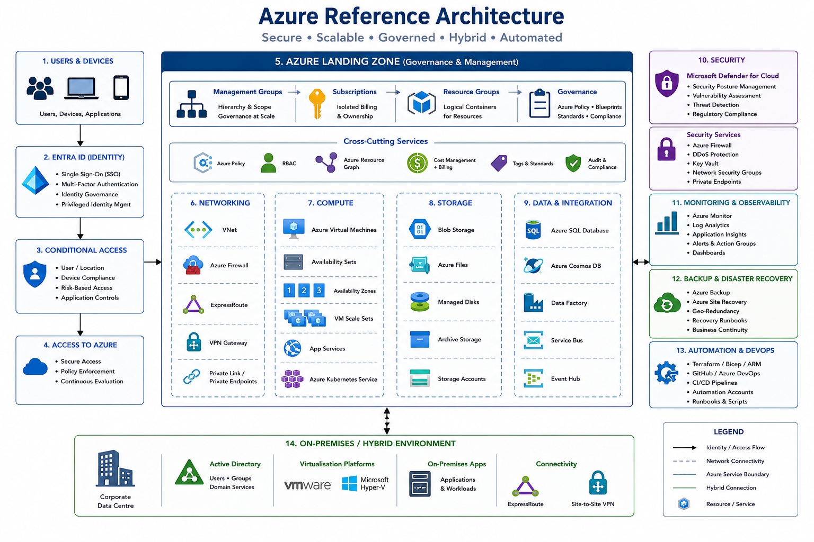

# Microsoft Azure

### Cloud Architecture • Governance • Identity • Hybrid Infrastructure

---

## Overview

Microsoft Azure provides enterprise cloud services supporting infrastructure modernisation, application hosting, identity management, security, business continuity, and hybrid cloud integration.

This section contains enterprise reference architectures, governance frameworks, implementation guidance, migration strategies, operational standards, and best practices used to design and manage Azure environments.

The objective is to establish secure, scalable, resilient, and well-governed cloud platforms that integrate seamlessly with enterprise infrastructure.

---

## Reference Architecture

---

## Quick Navigation

| Domain            | Description                                      |
| ----------------- | ------------------------------------------------ |
| Landing Zones     | Governance, subscriptions, resource organisation |
| Networking        | VNets, ExpressRoute, VPN, connectivity           |
| Identity          | Entra ID, Conditional Access, MFA                |
| Compute           | Azure Virtual Machines and services              |
| Security          | Defender for Cloud, Security Centre              |
| Monitoring        | Azure Monitor, Log Analytics                     |
| Backup & Recovery | Business continuity and DR                       |
| Automation        | Terraform, PowerShell, Bicep                     |

---

# Core Azure Services

## Azure Networking

Enterprise connectivity supporting hybrid infrastructure and cloud services.

### Technologies

* Virtual Networks (VNet)
* ExpressRoute
* VPN Gateway
* Network Security Groups
* Azure Firewall
* Load Balancers

### Objectives

* Secure Connectivity
* Network Segmentation
* High Availability
* Cloud Integration

---

## Azure Compute

Provides scalable cloud-based compute resources.

### Services

* Azure Virtual Machines
* Availability Sets
* Availability Zones
* Virtual Machine Scale Sets
* Azure App Services

---

## Azure Storage

Provides resilient cloud storage services.

### Storage Types

* Blob Storage
* File Shares
* Managed Disks
* Archive Storage

---

## Identity & Access Management

### Microsoft Entra ID

Enterprise cloud identity platform.

### Features

* Single Sign-On
* Multi-Factor Authentication
* Conditional Access
* Identity Governance
* Self-Service Password Reset

### Hybrid Identity

* Entra Connect
* Hybrid Join
* Password Hash Sync
* Seamless SSO

---

## Azure Landing Zones

Provides governance and standardisation for cloud deployments.

### Components

* Management Groups
* Subscriptions
* Resource Groups
* Policies
* Blueprints
* RBAC

### Benefits

* Consistency
* Governance
* Security
* Scalability

---

## Security

### Microsoft Defender for Cloud

Provides security posture management and threat protection.

### Capabilities

* Security Recommendations
* Vulnerability Assessment
* Regulatory Compliance
* Threat Detection

---

### Azure Security Controls

* Conditional Access
* MFA
* RBAC
* PIM
* Key Vault
* Azure Firewall

---

## Monitoring & Observability

### Azure Monitor

Provides infrastructure and application monitoring.

### Services

* Log Analytics
* Azure Monitor
* Application Insights
* Alerts
* Dashboards

### Objectives

* Visibility
* Performance Monitoring
* Capacity Planning
* Incident Response

---

## Backup & Disaster Recovery

### Azure Backup

Protects workloads and data.

### Azure Site Recovery

Provides disaster recovery and business continuity.

### Objectives

* Data Protection
* Recovery Testing
* Business Continuity
* Compliance

---

## Infrastructure as Code

### Terraform

Automates Azure resource deployment.

### Capabilities

* Repeatable Deployments
* Standardisation
* Version Control
* Automation

### Additional Tools

* Bicep
* ARM Templates
* PowerShell
* Azure CLI

---

## Hybrid Cloud Integration

Azure integrates with existing enterprise infrastructure.

### Connected Services

* Active Directory
* VMware
* Hyper-V
* Microsoft 365
* Intune
* On-Prem Networks

### Connectivity Methods

* ExpressRoute
* Site-to-Site VPN
* Azure Arc

---

## Design Principles

### Security First

Apply Zero Trust and identity-driven controls.

### Governance

Implement policies and standards from day one.

### Scalability

Support future growth and business requirements.

### Resilience

Design for high availability and disaster recovery.

### Automation

Use Infrastructure as Code wherever possible.

### Cost Optimisation

Monitor and manage cloud spending effectively.

---

## Current Roadmap

* [ ] Azure Landing Zone Architecture
* [ ] Hybrid Cloud Architecture
* [ ] ExpressRoute Design
* [ ] Azure Security Framework
* [ ] Monitoring Architecture
* [ ] Disaster Recovery Design
* [ ] Terraform Examples
* [ ] Cost Optimisation Framework

---

## Future Enhancements

* Azure Arc
* Azure Virtual Desktop
* Azure Kubernetes Service
* Microsoft Fabric
* Azure AI Services
* FinOps Governance

---

## Status

🚧 Active Development

This section is being expanded with Azure architectures, governance frameworks, hybrid cloud designs, security controls, operational guidance, and Infrastructure as Code examples.
