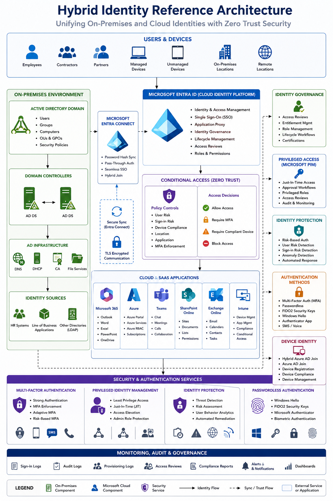

# Hybrid Identity

### Identity • Authentication • Access Control • Zero Trust

---

## Overview

Hybrid Identity extends traditional on-premises Active Directory environments into modern cloud platforms by integrating Microsoft Entra ID, Microsoft 365, Azure services, endpoint management, and security controls.

This section contains enterprise reference architectures, governance frameworks, implementation guidance, and operational practices used to design and manage modern identity platforms.

The objective is to provide secure, scalable, and unified identity services supporting users, devices, applications, and cloud workloads.

---

## Reference Architecture

---

## Business Objectives

* Unified Identity Platform
* Single Sign-On (SSO)
* Improved Security
* Zero Trust Adoption
* Simplified User Experience
* Cloud Integration
* Identity Governance

---

## Core Components

### Active Directory

Provides enterprise identity and authentication services.

#### Functions

* User Authentication
* Computer Authentication
* Group Policy
* Security Groups
* Delegated Administration

---

### Microsoft Entra Connect

Synchronises identities between Active Directory and Microsoft Entra ID.

#### Features

* Password Hash Synchronisation
* Pass-Through Authentication
* Seamless Single Sign-On
* Hybrid Join

---

### Microsoft Entra ID

Cloud identity and access management platform.

#### Capabilities

* Authentication
* Identity Governance
* Access Reviews
* Application Access
* Lifecycle Management

---

## Authentication Services

### Single Sign-On (SSO)

Allows users to access multiple systems using a single identity.

### Multi-Factor Authentication (MFA)

Provides additional identity verification.

### Passwordless Authentication

Supports modern authentication methods.

#### Technologies

* Windows Hello for Business
* FIDO2 Security Keys
* Microsoft Authenticator

---

## Conditional Access

Provides policy-based access control.

### Controls

* MFA Enforcement
* Device Compliance
* Location-Based Policies
* Risk-Based Authentication
* Application Controls

### Benefits

* Reduced Risk
* Improved Security
* Zero Trust Alignment

---

## Device Identity

### Hybrid Azure AD Join

Supports devices managed across on-premises and cloud environments.

### Azure AD Join

Supports cloud-native endpoint deployments.

### Device Registration

Provides device visibility and compliance validation.

---

## Identity Governance

### Governance Controls

* Access Reviews
* Role Management
* Entitlement Management
* Lifecycle Workflows

### Objectives

* Reduce Risk
* Improve Compliance
* Automate Access Control

---

## Privileged Access Management

### Microsoft PIM

Provides privileged identity controls.

### Features

* Just-In-Time Access
* Approval Workflows
* Access Reviews
* Privileged Role Monitoring

---

## Security Controls

### Identity Protection

Provides risk-based detection and response.

### Security Features

* Risk-Based Authentication
* User Risk Detection
* Sign-In Risk Detection
* Automated Remediation

---

## Integration Services

### Microsoft 365

* Exchange Online
* Teams
* SharePoint
* OneDrive

### Microsoft Azure

* Azure Virtual Machines
* Azure RBAC
* Azure Arc
* Azure Monitor

### Microsoft Intune

* Device Compliance
* Endpoint Management
* Conditional Access Integration

---

## Monitoring & Operations

### Monitoring Areas

* Authentication Activity
* Synchronisation Health
* Identity Risks
* Access Reviews
* MFA Adoption

### Operational Activities

* User Lifecycle Management
* Access Reviews
* Policy Validation
* Security Auditing

---

## Design Principles

### Security First

Protect identities as the primary security boundary.

### Zero Trust

Verify every user, device, and access request.

### Simplicity

Provide a seamless user experience.

### Governance

Maintain visibility and control over identity services.

### Automation

Reduce manual administration through automation.

---

## Validation Checklist

* [ ] Entra Connect operational
* [ ] Synchronisation validated
* [ ] MFA enabled
* [ ] Conditional Access policies tested
* [ ] Device registration validated
* [ ] PIM configured
* [ ] Monitoring enabled
* [ ] Documentation completed

---

## Future Enhancements

* Passwordless Authentication
* Identity Lifecycle Automation
* Entra ID Governance
* Defender for Identity
* Risk-Based Access Control
* Cross-Tenant Identity

---

## Related Technologies

* Windows Server
* Active Directory
* Microsoft Entra ID
* Microsoft 365
* Azure
* Intune
* Defender for Identity

---

## Status

🚧 Active Development

This section is being expanded with hybrid identity architectures, governance frameworks, Zero Trust controls, privileged access management, and enterprise authentication standards.

