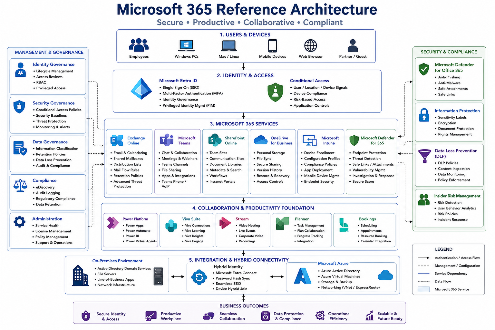

# Microsoft 365

### Collaboration • Productivity • Identity • Security • Compliance

---

## Overview

Microsoft 365 provides enterprise productivity, collaboration, security, compliance, identity, and endpoint management services.

This section contains reference architectures, governance frameworks, implementation guidance, operational standards, and best practices used to deploy, secure, and manage Microsoft 365 environments.

The objective is to establish a secure, scalable, compliant, and user-focused digital workplace platform.

---

## Reference Architecture

---

## Core Services

### Microsoft Entra ID

Enterprise identity and access management platform.

#### Features

* Single Sign-On (SSO)
* Multi-Factor Authentication (MFA)
* Conditional Access
* Identity Governance
* Self-Service Password Reset

---

### Exchange Online

Enterprise email and calendaring platform.

#### Capabilities

* Mailboxes
* Shared Mailboxes
* Distribution Lists
* Mail Flow Rules
* Retention Policies
* Email Security

---

### Microsoft Teams

Unified communications and collaboration platform.

#### Capabilities

* Chat
* Meetings
* Voice Services
* Teams Phone
* Collaboration Spaces
* File Sharing

---

### SharePoint Online

Enterprise content management and collaboration platform.

#### Capabilities

* Intranet Portals
* Document Libraries
* Team Sites
* Knowledge Management
* Workflow Integration

---

### OneDrive for Business

Personal cloud storage and secure file sharing.

#### Features

* File Synchronisation
* Secure Sharing
* Version History
* Data Protection

---

## Endpoint Management

### Microsoft Intune

Cloud-based endpoint management platform.

#### Functions

* Device Enrolment
* Compliance Policies
* Configuration Profiles
* Application Deployment
* Mobile Device Management

---

### Windows Autopilot

Modern endpoint provisioning and deployment.

#### Benefits

* Zero Touch Deployment
* Standardisation
* Faster Onboarding
* Reduced Operational Effort

---

## Security & Compliance

### Microsoft Defender

Integrated threat protection platform.

#### Capabilities

* Endpoint Protection
* Threat Detection
* Vulnerability Management
* Incident Response

---

### Conditional Access

Identity-based access control framework.

#### Controls

* MFA Enforcement
* Device Compliance
* Risk-Based Authentication
* Location Controls

---

### Compliance

Enterprise governance and compliance capabilities.

#### Areas

* Data Loss Prevention (DLP)
* Information Protection
* Retention Policies
* eDiscovery
* Audit Logging

---

## Collaboration Services

### Teams Phone

Enterprise voice services supporting:

* Direct Routing
* Calling Plans
* VoIP Migration
* Unified Communications

### SharePoint Intranet

Supports:

* Internal Communications
* Knowledge Management
* Department Portals
* Document Governance

---

## Governance Framework

### Identity Governance

* Role-Based Access Control
* Privileged Identity Management
* Access Reviews
* Lifecycle Management

### Security Governance

* Conditional Access Policies
* Security Baselines
* Compliance Standards
* Monitoring Frameworks

### Data Governance

* Information Classification
* Retention Management
* Data Protection
* Compliance Controls

---

## Monitoring & Operations

### Monitoring Areas

* User Adoption
* Service Health
* Security Events
* Compliance Status
* Endpoint Health

### Operational Activities

* Licence Management
* Policy Administration
* Security Reviews
* User Lifecycle Management

---

## Hybrid Integration

### Connected Services

* Active Directory
* Entra ID
* Azure
* Intune
* Defender
* Exchange Hybrid

### Integration Benefits

* Unified Identity
* Improved Security
* Simplified Management
* Operational Efficiency

---

## Design Principles

### Security First

Protect identities, devices, applications, and data.

### User Experience

Enable secure and productive collaboration.

### Governance

Implement standards, policies, and compliance controls.

### Automation

Reduce operational overhead through automation.

### Scalability

Support organisational growth and adoption.

---

## Current Roadmap

* [ ] Microsoft 365 Reference Architecture
* [ ] Exchange Online Framework
* [ ] Teams Collaboration Architecture
* [ ] SharePoint Governance Model
* [ ] Intune Integration Framework
* [ ] Conditional Access Standards
* [ ] Compliance Framework
* [ ] Teams Voice Architecture

---

## Future Enhancements

* Microsoft Copilot
* Defender XDR
* Purview
* Teams Premium
* SharePoint Premium
* Power Platform Governance
* Viva Suite

---

## Status

🚧 Active Development

This section is being expanded with Microsoft 365 architectures, governance frameworks, collaboration standards, security controls, compliance models, and operational best practices.
