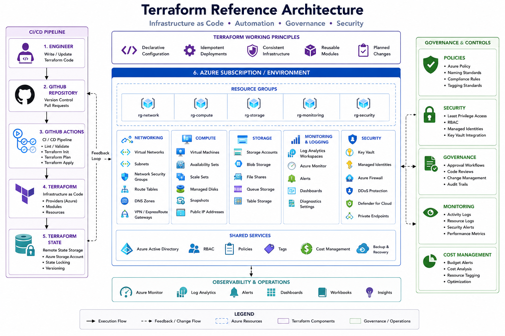

# Terraform


### Infrastructure as Code • Automation • Cloud Provisioning • Governance

---

## Overview

Terraform is an Infrastructure as Code (IaC) platform used to automate the deployment, configuration, and lifecycle management of cloud and infrastructure resources.

This section contains reference architectures, deployment examples, reusable modules, governance standards, and operational practices used to provision enterprise infrastructure consistently and securely.

The objective is to reduce manual deployment effort, improve standardisation, increase reliability, and support scalable cloud adoption.

---

## Reference Architecture



---

## Core Capabilities

### Infrastructure as Code

Provision infrastructure through version-controlled code.

### Automation

Automate repeatable deployments and operational tasks.

### Standardisation

Ensure environments are deployed consistently.

### Governance

Apply security, compliance, and organisational standards.

### Scalability

Support rapid growth through reusable deployment models.

---

## Technology Stack

### Terraform

Core Infrastructure as Code platform.

### GitHub

Source control and collaboration.

### Azure

Cloud platform hosting deployed infrastructure.

### PowerShell

Automation and operational scripting.

### Azure DevOps / GitHub Actions

CI/CD integration and deployment automation.

---

## Deployment Workflow

```text
Developer
    │
    ▼
Git Repository
    │
    ▼
Terraform Plan
    │
    ▼
Terraform Apply
    │
    ▼
Azure Resources
```

---

## Example Deployments

### Azure Networking

* Virtual Networks
* Subnets
* Route Tables
* NSGs
* DNS

### Azure Compute

* Virtual Machines
* Availability Sets
* Managed Disks

### Identity

* Resource RBAC
* Managed Identities

### Monitoring

* Log Analytics
* Azure Monitor
* Alerts

---

## Repository Structure

```text
terraform
│
├── azure-vnet
├── azure-vm
├── azure-landing-zone
├── modules
│
├── images
└── README.md
```

---

## Reusable Modules

### Network Module

Deploy:

* VNets
* Subnets
* NSGs
* Route Tables

### Compute Module

Deploy:

* Azure VMs
* Availability Sets
* Managed Disks

### Monitoring Module

Deploy:

* Log Analytics
* Azure Monitor
* Alerts

---

## Azure Landing Zone

Terraform can be used to deploy:

* Management Groups
* Subscriptions
* Policies
* Resource Groups
* Networking
* Security Controls

### Benefits

* Governance
* Standardisation
* Security
* Automation

---

## Security Considerations

### State Management

* Secure Storage Accounts
* Remote State
* RBAC Controls

### Secrets Management

* Azure Key Vault
* Managed Identities
* Secure Variables

### Access Control

* Least Privilege
* Role-Based Access Control
* Change Approval Processes

---

## Design Principles

### Automation First

Automate wherever possible.

### Reusability

Create modular deployments.

### Security

Protect state files and secrets.

### Governance

Enforce organisational standards.

### Consistency

Reduce configuration drift.

---

## Validation Checklist

* [ ] Code reviewed
* [ ] Terraform validated
* [ ] Plan reviewed
* [ ] Security controls applied
* [ ] State storage configured
* [ ] Documentation completed
* [ ] Deployment tested

---

## Future Enhancements

* Azure Landing Zones
* GitHub Actions
* Azure DevOps Pipelines
* Terraform Cloud
* Policy as Code
* FinOps Automation

---

## Status

🚧 Active Development

This section is being expanded with reusable Terraform modules, Azure deployment examples, governance frameworks, CI/CD integrations, and Infrastructure as Code best practices.
