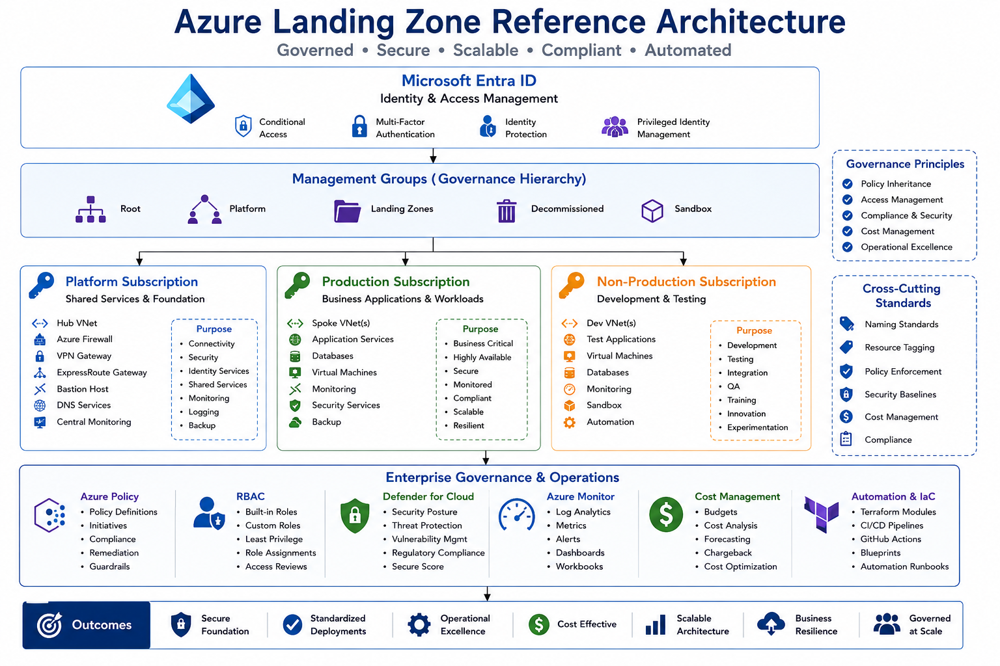

# Azure Landing Zone


### Cloud Foundation • Governance • Security • Enterprise Scale

---

## Overview

Azure Landing Zones provide the foundational architecture required to deploy and manage Azure environments securely, consistently, and at scale.

A Landing Zone establishes governance, identity, networking, security, monitoring, and operational controls before workloads are deployed.

This section contains enterprise reference architectures, governance frameworks, Terraform deployment patterns, and best practices aligned with Microsoft's Cloud Adoption Framework.

---

## Reference Architecture



---

## Business Objectives

* Standardised Cloud Deployments
* Governance & Compliance
* Security by Design
* Operational Consistency
* Scalable Cloud Adoption
* Cost Management
* Business Continuity

---

## Core Components

### Management Groups

Provide hierarchical governance across Azure subscriptions.

#### Benefits

* Policy Inheritance
* Centralised Governance
* Consistent Standards
* Simplified Administration

---

### Azure Subscriptions

Logical separation of workloads and environments.

### Example Structure

```text
Platform Subscription
Production Subscription
Non-Production Subscription
Sandbox Subscription
```

---

### Resource Groups

Logical containers for Azure resources.

#### Purpose

* Resource Organisation
* Lifecycle Management
* Access Delegation

---

## Identity & Access Management

### Microsoft Entra ID

Provides centralised identity and access control.

### Security Controls

* Multi-Factor Authentication
* Conditional Access
* Identity Protection
* Privileged Identity Management

### RBAC

Role-Based Access Control provides least-privilege administration.

---

## Network Architecture

### Hub & Spoke Design

Recommended enterprise network topology.

#### Hub Services

* Azure Firewall
* VPN Gateway
* ExpressRoute Gateway
* Shared Services

#### Spoke Networks

* Production Workloads
* Development Environments
* Business Applications

---

## Security Architecture

### Azure Policy

Provides governance and compliance enforcement.

### Example Policies

* Allowed Regions
* Resource Tagging
* Storage Encryption
* Security Baselines

### Microsoft Defender for Cloud

Provides:

* Security Posture Management
* Threat Detection
* Compliance Reporting

---

## Monitoring & Observability

### Azure Monitor

Provides operational visibility.

### Services

* Azure Monitor
* Log Analytics
* Alerts
* Dashboards

### Objectives

* Performance Monitoring
* Operational Visibility
* Incident Detection
* Capacity Planning

---

## Governance Framework

### Naming Standards

Consistent naming conventions across all resources.

### Resource Tagging

Example Tags:

```text
Environment
Application
Owner
Cost Centre
Business Unit
```

### Policy Enforcement

* Resource Compliance
* Security Standards
* Deployment Controls

---

## Cost Management

### FinOps Principles

* Budget Management
* Resource Optimisation
* Cost Visibility
* Chargeback Reporting

### Azure Cost Management

Provides:

* Budgets
* Cost Analysis
* Forecasting
* Reporting

---

## Business Continuity

### Azure Backup

Protects cloud workloads.

### Azure Site Recovery

Provides disaster recovery capabilities.

### Objectives

* Recovery Readiness
* Resilience
* Compliance

---

## Terraform Integration

### Deployment Areas

* Management Groups
* Resource Groups
* Virtual Networks
* Policies
* RBAC
* Monitoring

### Benefits

* Standardisation
* Automation
* Governance
* Repeatability

---

## Design Principles

### Security First

Implement Zero Trust and least-privilege access.

### Governance by Default

Apply policies and standards from day one.

### Scalability

Support future growth without redesign.

### Automation

Use Infrastructure as Code for all deployments.

### Operational Excellence

Enable monitoring, auditing, and lifecycle management.

---

## Validation Checklist

* [ ] Management Groups created
* [ ] Subscriptions assigned
* [ ] RBAC configured
* [ ] Policies deployed
* [ ] Network architecture implemented
* [ ] Monitoring enabled
* [ ] Cost controls configured
* [ ] Security baseline validated

---

## Related Technologies

* Microsoft Azure
* Microsoft Entra ID
* Terraform
* Azure Policy
* Defender for Cloud
* Azure Monitor
* Hybrid Identity

---

## Future Enhancements

* Azure Virtual WAN
* Multi-Region Design
* Zero Trust Networking
* Platform Engineering
* FinOps Automation
* Policy as Code
* Landing Zone Accelerator

---

## Status

🚧 Active Development

This section is being expanded with enterprise landing zone architectures, governance frameworks, Terraform deployment examples, security baselines, and operational standards supporting large-scale Azure environments.
