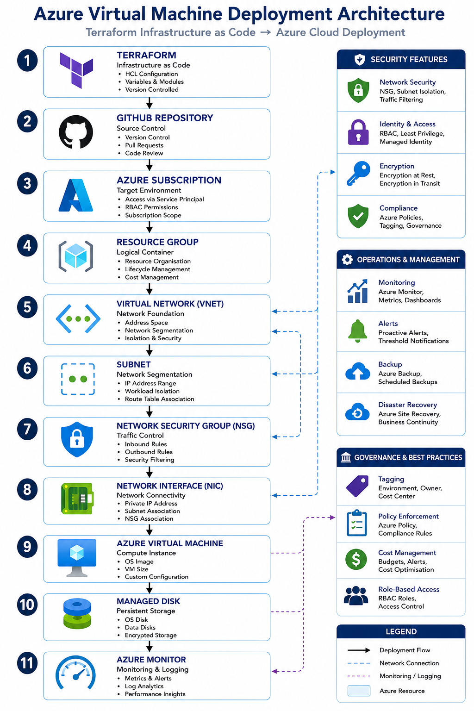

# Azure Virtual Machine Deployment


### Infrastructure as Code • Azure Compute • Enterprise Deployment

---

## Overview

This example demonstrates the deployment of Azure Virtual Machines using Terraform.

The solution provides a repeatable, scalable, and secure deployment model supporting enterprise workloads while maintaining governance, consistency, and operational standards.

Infrastructure as Code enables organisations to automate deployments, reduce configuration drift, improve security, and accelerate cloud adoption.

---

## Reference Architecture



---

## Business Objectives

* Automated Infrastructure Deployment
* Standardised Build Configuration
* Reduced Provisioning Time
* Consistent Security Controls
* Governance Compliance
* Scalable Cloud Infrastructure
* Operational Efficiency

---

## Architecture Components

### Resource Group

Provides logical organisation and lifecycle management of Azure resources.

### Virtual Network (VNet)

Provides network connectivity and segmentation for Azure workloads.

### Subnet

Separates workloads into logical network zones.

### Network Security Group (NSG)

Controls inbound and outbound traffic using security rules.

### Network Interface (NIC)

Connects virtual machines to Azure networking services.

### Azure Virtual Machine

Provides compute resources supporting enterprise applications and infrastructure services.

### Managed Disk

Provides resilient and scalable storage for virtual machine workloads.

### Azure Monitor

Provides visibility into infrastructure performance, availability, and operational health.

---

## Deployment Workflow

```text
Terraform Code
       │
       ▼
Terraform Plan
       │
       ▼
Terraform Apply
       │
       ▼
Azure Resource Group
       │
       ▼
Virtual Network
       │
       ▼
Subnet
       │
       ▼
Network Security Group
       │
       ▼
Network Interface
       │
       ▼
Azure Virtual Machine
       │
       ▼
Azure Monitor
```

---

## Example Use Cases

### Application Hosting

* Business Applications
* Web Servers
* Middleware Platforms
* API Services

### Infrastructure Services

* Active Directory
* DNS
* DHCP
* Certificate Services

### Migration Projects

* VMware to Azure
* Hyper-V to Azure
* Data Centre Consolidation

### Development Environments

* Test Platforms
* Staging Environments
* Development Labs

---

## Security Controls

### Identity Security

* Managed Identities
* Role-Based Access Control (RBAC)
* Least Privilege Access

### Network Security

* Network Security Groups
* Private Endpoints
* Segmentation Controls

### Data Protection

* Managed Disk Encryption
* Encryption at Rest
* Encryption in Transit

### Monitoring & Detection

* Azure Monitor
* Log Analytics
* Security Alerts
* Defender for Cloud

---

## Example Terraform Resources

### Core Resources

```terraform
azurerm_resource_group
azurerm_virtual_network
azurerm_subnet
azurerm_network_security_group
azurerm_network_interface
azurerm_windows_virtual_machine
azurerm_linux_virtual_machine
azurerm_managed_disk
```

---

## Operational Considerations

### Monitoring

* CPU Utilisation
* Memory Consumption
* Disk Performance
* Network Throughput
* Availability Metrics

### Maintenance

* Patch Management
* Backup Validation
* Capacity Planning
* Security Reviews
* Lifecycle Management

---

## Backup & Recovery

### Azure Backup

Protects virtual machine workloads and operating systems.

### Azure Site Recovery

Provides disaster recovery and business continuity capabilities.

### Objectives

* Data Protection
* Recovery Validation
* Business Continuity
* Compliance

---

## Design Principles

### Automation First

Automate deployments to reduce manual effort and risk.

### Standardisation

Ensure consistent infrastructure builds across environments.

### Security

Implement security controls throughout the deployment lifecycle.

### Scalability

Support future workload growth and expansion.

### Resilience

Design for availability, backup, and disaster recovery.

### Governance

Apply policies, tagging, and organisational standards.

---

## Validation Checklist

* [ ] Resource Group created
* [ ] Virtual Network deployed
* [ ] Subnets configured
* [ ] NSGs applied
* [ ] Virtual Machine provisioned
* [ ] Monitoring enabled
* [ ] Backup configured
* [ ] Security controls validated
* [ ] Documentation completed

---

## Related Technologies

* Microsoft Azure
* Terraform
* Azure Monitor
* Defender for Cloud
* Windows Server
* Linux Server
* Hybrid Identity

---

## Future Enhancements

* Availability Sets
* Availability Zones
* VM Scale Sets
* Azure Backup Integration
* Azure Site Recovery
* Golden Image Deployment
* Automated OS Hardening
* CI/CD Integration

---

## Status

🚧 Active Development

This example is being expanded with production-ready Terraform templates, Azure governance controls, monitoring integrations, security frameworks, and operational automation patterns.
