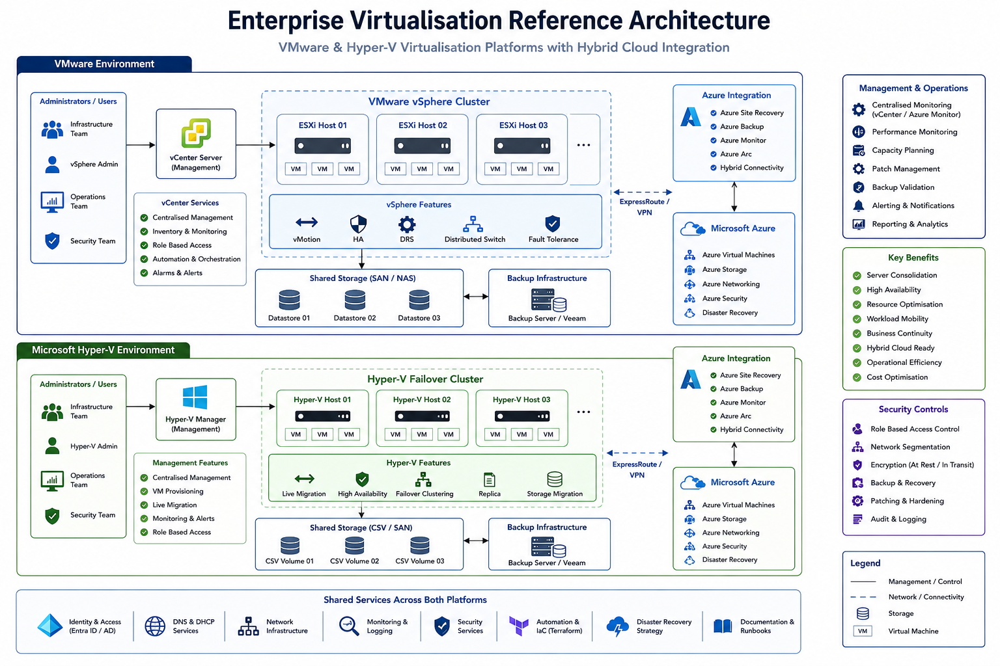

# Enterprise Virtualisation

## Overview

Virtualisation platforms provide the foundation for modern enterprise infrastructure by enabling efficient resource utilisation, workload consolidation, scalability, resilience, and hybrid cloud integration.

This section contains enterprise virtualisation architectures, deployment standards, operational guidance, migration frameworks, and best practices supporting VMware, Hyper-V, and hybrid cloud environments.

---

## Reference Architecture

---

## Business Objectives

* Server Consolidation
* High Availability
* Resource Optimisation
* Hybrid Cloud Integration
* Business Continuity
* Operational Efficiency
* Infrastructure Scalability

---

## Platform Technologies

### VMware

Enterprise virtualisation platform supporting:

* ESXi
* vCenter
* vMotion
* DRS
* HA Clustering
* Distributed Switching

### Microsoft Hyper-V

Enterprise virtualisation platform supporting:

* Hyper-V
* Failover Clustering
* Live Migration
* Replica
* Storage Migration
* Virtual Networking

---

## VMware Architecture

### Core Components

| Component  | Purpose                 |
| ---------- | ----------------------- |
| ESXi Hosts | Virtual Machine Hosting |
| vCenter    | Centralised Management  |
| vMotion    | Live Migration          |
| DRS        | Resource Optimisation   |
| HA         | Automatic Recovery      |
| Datastores | Shared Storage          |

### Benefits

* Centralised Management
* High Availability
* Workload Mobility
* Resource Optimisation
* Enterprise Scalability

---

## Hyper-V Architecture

### Core Components

| Component              | Purpose                 |
| ---------------------- | ----------------------- |
| Hyper-V Hosts          | Virtual Machine Hosting |
| Failover Cluster       | High Availability       |
| Live Migration         | Workload Mobility       |
| Cluster Shared Volumes | Shared Storage          |
| Hyper-V Manager        | Administration          |
| SCVMM (Optional)       | Centralised Management  |

### Benefits

* Microsoft Integration
* Cost Efficiency
* High Availability
* Hybrid Cloud Readiness
* Simplified Management

---

## Hybrid Cloud Integration

Modern virtualisation platforms increasingly integrate with cloud services.

### Azure Integration

* Azure Site Recovery
* Azure Backup
* Azure Migrate
* Azure Arc
* Azure Monitor

### Migration Scenarios

* VMware to Azure
* Hyper-V to Azure
* Hybrid Infrastructure
* Disaster Recovery as a Service

---

## Storage Architecture

### Storage Technologies

* SAN
* NAS
* iSCSI
* Fibre Channel
* Cluster Shared Volumes

### Design Considerations

* Redundancy
* Performance
* Capacity Planning
* Backup Integration
* Disaster Recovery

---

## Network Integration

Virtualisation platforms rely on resilient networking.

### Technologies

* VLANs
* Virtual Switches
* Distributed Switching
* NIC Teaming
* SD-WAN Integration

### Objectives

* High Availability
* Security Segmentation
* Performance Optimisation
* Scalability

---

## Monitoring & Operations

### Monitoring Areas

* CPU Utilisation
* Memory Consumption
* Storage Performance
* VM Availability
* Cluster Health

### Operational Activities

* Capacity Planning
* Patch Management
* Backup Validation
* Resource Optimisation
* Lifecycle Management

---

## Business Continuity

### Backup & Recovery

* VM Backups
* Application-Aware Backups
* Offsite Replication
* Recovery Testing

### Disaster Recovery

* Site Failover
* Azure Site Recovery
* VM Replication
* Recovery Runbooks

---

## Design Principles

### Scalability

Support future infrastructure growth.

### Resilience

Eliminate single points of failure.

### Automation

Automate provisioning and lifecycle management.

### Security

Protect workloads and management platforms.

### Standardisation

Maintain consistent deployment models.

---

## Validation Checklist

* [ ] Cluster configured
* [ ] Shared storage validated
* [ ] Live migration tested
* [ ] Backup validation completed
* [ ] Monitoring enabled
* [ ] Disaster recovery tested
* [ ] Documentation completed

---

## Future Enhancements

* Azure Arc Integration
* VMware Cloud
* Azure VMware Solution
* Infrastructure as Code
* Automated Provisioning
* Platform Observability

---

## Status

🚧 Active Development

This section is being expanded with VMware architectures, Hyper-V deployments, migration frameworks, hybrid cloud integrations, disaster recovery strategies, and operational best practices.

