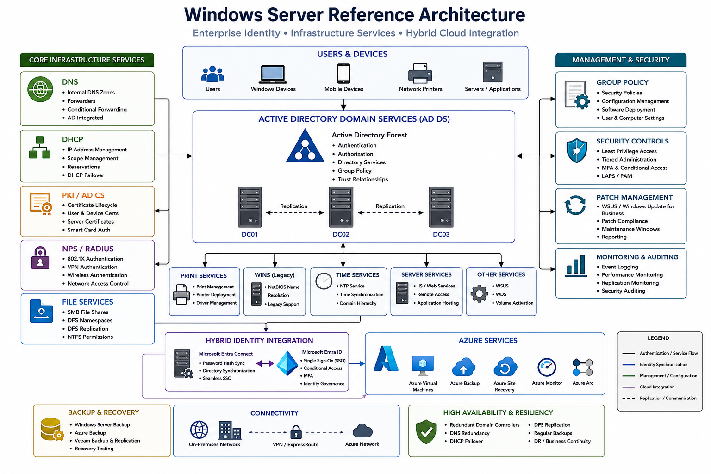

# Windows Server

### Enterprise Identity • Infrastructure Services • Hybrid Cloud Integration

---

## Overview

Windows Server provides the core infrastructure services that underpin enterprise identity, authentication, networking, endpoint management, and application delivery.

This section contains reference architectures, operational standards, deployment guidance, governance frameworks, and best practices used to design, implement, secure, and maintain enterprise Windows Server environments.

The objective is to establish secure, resilient, scalable, and cloud-integrated server infrastructure capable of supporting modern business operations.

---

## Reference Architecture

---

## Quick Navigation

| Domain           | Description                                     |
| ---------------- | ----------------------------------------------- |
| Active Directory | Enterprise identity and authentication services |
| DNS              | Internal and external name resolution           |
| DHCP             | Automated IP address allocation                 |
| PKI              | Certificate services and encryption             |
| Group Policy     | Centralised configuration management            |
| File Services    | Enterprise file storage and access              |
| Hybrid Identity  | Entra ID integration and synchronisation        |
| Operations       | Monitoring, backup, recovery, and maintenance   |

---

## Core Infrastructure Services

### Active Directory Domain Services

Provides centralised authentication, authorisation, identity management, and policy enforcement.

#### Capabilities

* User Authentication
* Computer Authentication
* Organisational Units (OU)
* Group Policy
* Trust Relationships
* Security Groups
* Delegated Administration

---

### DNS

Enterprise name resolution services supporting internal applications, Active Directory, cloud services, and infrastructure platforms.

#### Functions

* Internal DNS Zones
* Conditional Forwarding
* DNS Forwarders
* Active Directory Integration
* Service Discovery

---

### DHCP

Automated IP address management and endpoint network configuration.

#### Functions

* IP Address Allocation
* Scope Management
* Reservations
* Lease Management
* DHCP Failover

---

### Public Key Infrastructure (PKI)

Provides certificate-based authentication, encryption, and secure communications.

#### Common Use Cases

* Wireless Authentication
* VPN Authentication
* Device Certificates
* Server Certificates
* Web Applications
* Code Signing

---

## Identity & Access Management

### Active Directory

The primary identity platform for enterprise authentication and access control.

#### Components

* Domain Controllers
* Forests
* Domains
* Sites & Services
* Trust Relationships

---

### Microsoft Entra ID

Hybrid identity integration extending Active Directory into Microsoft cloud services.

#### Features

* Identity Synchronisation
* Password Hash Sync
* Seamless SSO
* Conditional Access
* Multi-Factor Authentication
* Self-Service Password Reset

---

### Hybrid Identity

Supports unified identity management across on-premises and cloud environments.

#### Technologies

* Entra Connect
* Entra ID
* Active Directory
* Conditional Access
* Hybrid Join

---

## Group Policy Management

Group Policy provides centralised management of user and computer settings.

### Common Policies

* Password Policies
* Security Baselines
* Firewall Rules
* Device Restrictions
* Software Deployment
* Administrative Controls

---

## File & Storage Services

Enterprise file services supporting secure access and collaboration.

### Technologies

* SMB
* DFS Namespaces
* DFS Replication
* NTFS Permissions
* Access-Based Enumeration

### Objectives

* Secure Access
* High Availability
* Data Protection
* Simplified Management

---

## Security Controls

### Identity Security

* Least Privilege Access
* Role-Based Access Control
* Administrative Separation
* Tiered Administration

### Server Security

* Security Baselines
* Patch Management
* Service Hardening
* Secure Administrative Access

### Endpoint Security Integration

* Microsoft Defender
* Device Compliance
* Credential Protection
* Attack Surface Reduction

---

## Monitoring & Operations

### Monitoring Areas

* Domain Controller Health
* DNS Availability
* DHCP Services
* Replication Status
* Authentication Events
* Certificate Expiry

### Operational Activities

* Patch Management
* Backup Validation
* Capacity Planning
* Security Auditing
* Disaster Recovery Testing

---

## High Availability

### Active Directory

* Multiple Domain Controllers
* Multi-Site Replication
* Redundant DNS

### DHCP

* DHCP Failover
* Scope Replication

### File Services

* DFS Replication
* Storage Redundancy

---

## Cloud Integration

### Microsoft Azure

* Azure Virtual Machines
* Azure Backup
* Azure Site Recovery
* Azure Monitor
* Azure Arc

### Hybrid Services

* Entra ID Synchronisation
* Hybrid Join
* Conditional Access
* Cloud Identity Governance

---

## Design Principles

### Security First

Implement identity-first security controls and least privilege access.

### Resilience

Design for high availability and business continuity.

### Standardisation

Maintain consistent deployment and operational standards.

### Scalability

Support organisational growth without major redesign.

### Cloud Readiness

Enable seamless integration with cloud services.

### Automation

Reduce manual effort through scripting and automation.

---

## Validation Checklist

* [ ] Domain Controllers deployed
* [ ] DNS validated
* [ ] DHCP operational
* [ ] PKI functioning
* [ ] Group Policies tested
* [ ] Entra ID synchronisation validated
* [ ] Monitoring enabled
* [ ] Backup testing completed
* [ ] Disaster recovery documented

---

## Future Enhancements

* Windows LAPS
* Defender for Identity
* Azure Arc
* Privileged Access Workstations
* Certificate Lifecycle Automation
* Infrastructure as Code
* Automated Server Provisioning

---

## Related Architecture Areas

* Enterprise Networking
* Hybrid Identity
* Endpoint Management
* Security Architecture
* Cloud Extensions
* Operations Management

---

## Status

🚧 Active Development

This section is being expanded with enterprise Windows Server architectures, Active Directory frameworks, hybrid identity integrations, PKI implementations, operational standards, and infrastructure governance practices.

