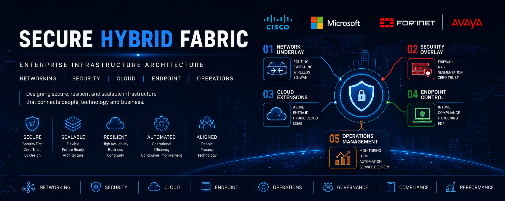

<p align="center">
  
</p>

# Secure Hybrid Fabric


---

# Enterprise Infrastructure Architecture Portfolio

> Enterprise infrastructure portfolio focused on networking, security architecture, cloud integration, hybrid identity, endpoint management, automation, and operational governance.

Secure Hybrid Fabric is a practical enterprise architecture portfolio demonstrating modern infrastructure design patterns, implementation standards, governance frameworks, migration methodologies, and operational practices commonly used across enterprise environments.

The repository is organised into architecture domains representing the core technology pillars found within modern organisations.

---

## Quick Navigation

| Domain                                                       | Description                                                                          | Status         |
| ------------------------------------------------------------ | ------------------------------------------------------------------------------------ | -------------- |
| [01 - Network Underlay](./01-network-underlay)               | Routing, switching, wireless, IP addressing, standards, and connectivity             | 🚧 In Progress |
| [02 - Security Overlay](./02-security-overlay)               | Zero Trust, firewalls, NAC, IAM, segmentation, and security controls                 | 🚧 In Progress |
| [03 - Cloud Extensions](./03-cloud-extensions)               | Azure, Microsoft 365, Hybrid Identity, Virtualisation, Windows Server, and Terraform | 🚧 In Progress |
| [04 - Endpoint Control](./04-endpoint-control)               | Intune, compliance, endpoint security, deployment, and lifecycle management          | 🚧 In Progress |
| [05 - Operations Management](./05-ops-management)            | ITSM, monitoring, automation, governance, and operational excellence                 | 🚧 In Progress |
| [06 - Enterprise Architecture](./06-enterprise-architecture) | Standards, roadmaps, governance, and strategic architecture frameworks               | 📋 Planned     |

---

## Architecture Library

| Area           | Key Technologies                                        |
| -------------- | ------------------------------------------------------- |
| Networking     | BGP, OSPF, VLANs, SD-WAN, Wireless, DNS, DHCP           |
| Security       | Fortinet, NAC, Zero Trust, Defender, Conditional Access |
| Cloud          | Azure, Microsoft 365, Entra ID, Terraform               |
| Infrastructure | Windows Server, Active Directory, VMware, Hyper-V       |
| Endpoint       | Intune, Autopilot, Compliance Policies, Defender        |
| Operations     | ITSM, Monitoring, Automation, VoIP, Governance          |

---

## Repository Structure

```text
secure-hybrid-fabric
│
├── 01-network-underlay
├── 02-security-overlay
├── 03-cloud-extensions
├── 04-endpoint-control
├── 05-ops-management
├── 06-enterprise-architecture
│
├── LICENSE
├── SECURITY.md
└── README.md
```

---

## Portfolio Objectives

✔ Enterprise Infrastructure Architecture

✔ Network Modernisation

✔ Security Hardening

✔ Hybrid Cloud Integration

✔ Identity & Access Management

✔ Endpoint Lifecycle Management

✔ Operational Governance

✔ Business Continuity & Resilience

✔ Infrastructure Standardisation

✔ Technical Documentation & Runbooks

✔ Infrastructure as Code

✔ Cloud Governance & Automation

---

## [01 - Network Underlay](./01-network-underlay) 🚧

Core networking and connectivity standards supporting resilient enterprise infrastructure.

### Technologies

Cisco • BGP • OSPF • VLAN • QoS • SD-WAN • Wireless LAN • VPN • DNS • DHCP

### Contents

* BGP routing architectures
* OSPF design patterns
* VLAN segmentation standards
* Enterprise IP addressing frameworks
* Network topology documentation
* Wireless architecture and heatmaps
* Routing and switching standards
* WAN and branch connectivity designs

---

## [02 - Security Overlay](./02-security-overlay) 🚧

Security architecture and access control frameworks protecting enterprise systems and services.

### Technologies

Fortinet • NAC • IPS • ACL • MFA • Conditional Access • EDR • Zero Trust

### Contents

* Firewall policy standards
* Security segmentation models
* NAC deployment frameworks
* Zero Trust architecture
* Identity and access controls
* Security hardening baselines
* Incident response references
* Security governance standards

---

## [03 - Cloud Extensions](./03-cloud-extensions) 🚧

Hybrid cloud architectures integrating enterprise infrastructure with Microsoft cloud platforms.

### Technologies

Microsoft Azure • Microsoft Entra ID • Microsoft 365 • Terraform • VMware • Hyper-V • Windows Server • Hybrid Identity

### Contents

* Azure architecture and governance
* Azure landing zones
* Windows Server infrastructure
* VMware and Hyper-V platforms
* Hybrid identity frameworks
* Microsoft 365 architecture
* Terraform deployment examples
* Infrastructure as Code
* Cloud migration frameworks
* Governance and compliance controls

---

## [04 - Endpoint Control](./04-endpoint-control) 🚧

Endpoint security and device lifecycle management standards.

### Technologies

Microsoft Intune • Windows • Defender • Active Directory • Compliance Policies

### Contents

* Intune configuration profiles
* Compliance frameworks
* Device deployment standards
* Endpoint security baselines
* Active Directory hardening
* Patch management procedures
* Device lifecycle governance

---

## [05 - Operations Management](./05-ops-management) 🚧

Operational governance, service management, monitoring, and automation practices.

### Technologies

ITSM • Asana • Monitoring Platforms • VoIP • Automation • Service Delivery

### Contents

* Change management procedures
* Incident response playbooks
* Operational runbooks
* VoIP migration frameworks
* Monitoring and observability standards
* Service management workflows
* Operational automation references

---

## Current Roadmap

* [x] Network Underlay Framework
* [x] Cloud Extensions Framework
* [x] Windows Server Framework
* [x] Virtualisation Framework
* [x] Hybrid Identity Framework
* [x] Microsoft 365 Framework
* [x] Terraform Framework
* [ ] Security Overlay Framework
* [ ] Endpoint Control Framework
* [ ] Operations Governance Framework
* [ ] Enterprise Architecture Framework

---

## Portfolio Metrics

| Category                | Coverage |
| ----------------------- | -------- |
| Network Architecture    | ✅        |
| Security Architecture   | 🚧       |
| Cloud Architecture      | ✅        |
| Endpoint Management     | 🚧       |
| Operations Management   | 🚧       |
| Enterprise Standards    | 🚧       |
| Infrastructure as Code  | ✅        |
| Reference Architectures | Growing  |
| Technical Documentation | Growing  |

### Current Technology Coverage

* Cisco
* Fortinet
* Microsoft Azure
* Microsoft 365
* Microsoft Entra ID
* Windows Server
* Active Directory
* VMware
* Hyper-V
* Terraform
* Intune
* Defender
* SD-WAN
* Wireless
* VoIP

---

## Disclaimer

This repository contains reference architectures, implementation examples, operational frameworks, technical standards, governance models, and portfolio material intended for educational and professional demonstration purposes.

All customer-specific information, credentials, configurations, and proprietary content have been removed.

---

### Maintained By

**Shehan**

Infrastructure Engineering • Cloud Architecture • Network Security • Operations Management
